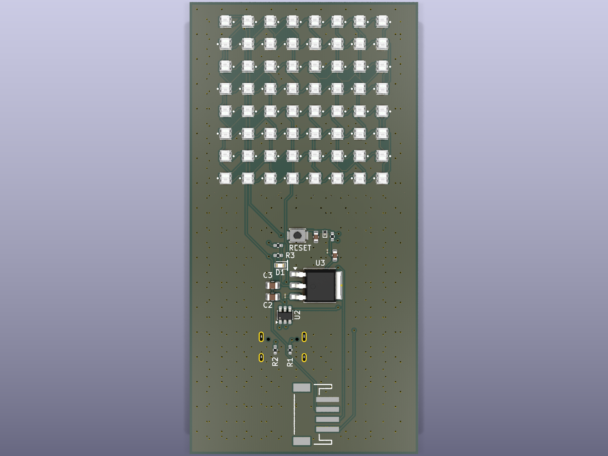

# esp32-led-matrix

Double-sided 8x8 WS2812B LED matrix board driven by an ESP32-C6-WROOM-1,
powered over USB-C. This design merges the MCU/power subsystem from
**esp32-ce-led** with the LED-matrix/JST-PH-connector pattern from
**xiao-led-module-**, extended to a double-sided 8x8 array (128 total LEDs,
two independent 64-LED daisy chains on GPIO6/GPIO7 — one per board side).



## Board Specs

| | |
|---|---|
| MCU | ESP32-C6-WROOM-1-N8 (Wi-Fi 6 / BLE 5, RISC-V) |
| Power in | USB-C (5V), on-board AMS1117-3.3 regulator for MCU rail |
| LED driver rail | +5V direct from USB-C (WS2812B needs ~5V, not 3.3V) |
| LEDs | 128x WS2812B-2020, 8x8 grid on F.Cu + 8x8 grid on B.Cu |
| LED chains | Chain A: D10→D73 (64 LEDs, GPIO6) · Chain B: D74→D137 (64 LEDs, GPIO7) |
| USB protection | USBLC6-2SC6 ESD array on D+/D-, ESD9B3.3ST5G on VBUS |
| Status | Power LED (D1), reset button (SW1) |
| External power option | JST-PH 4-pin connector (J2) for +5V/GND injection |
| Layers | 2 (F.Cu / B.Cu), GND + 5V copper pours on both sides |

Component numbering is intentional: **D1** and **D4** are reused from the
MCU/power subsystem (status LED, ESD diode); **D10 through D137** are the
128 matrix LEDs. The gap (D2/D3, D5–D9) is not a bug.

## BOM

Full JLCPCB-verified BOM with LCSC part numbers: [`BOM_jlcpcb_verified.csv`](BOM_jlcpcb_verified.csv)
(also duplicated as [`production/bom.csv`](production/bom.csv) in JLCPCB
upload format: Reference/Value/Footprint/LCSC/MPN/Manufacturer).

| Ref | Part | Qty | LCSC |
|---|---|---|---|
| U1 | ESP32-C6-WROOM-1-N8 | 1 | C5366877 |
| U2 | USBLC6-2SC6-FS | 1 | C6807798 |
| U3 | AMS1117-3.3 (TO-252) | 1 | C41347676 |
| D1 | Status LED (red, 0603) | 1 | C2286 |
| D4 | ESD9B3.3ST5G | 1 | C96512 |
| D10-D137 | WS2812B-2020 (compatible) | 128 | C5349955 |
| SW1 | Tactile switch (B3U-1000P) | 1 | C231329 |
| J4 | USB-C receptacle 16-pin | 1 | C3020560 |
| J2 | JST-PH 4-pin connector | 1 | C3029442 |
| R1, R2 | 5.1K 0402 | 2 | C25905 |
| R3 | 1K 0402 | 1 | C11702 |
| R7, R8 | 10K 0402 | 2 | C25744 |
| C1, C6 | 100nF 01005 | 2 | C307376 |
| C2, C3 | 22uF 0805 | 2 | C129302 |
| C4 | 1uF 0603 | 1 | C15849 |
| C5 | 10uF 0603 | 1 | C7472959 |

Every part is Basic/Extended JLCPCB stock with a verified LCSC number; no
DNP parts in this design.

## Manufacturing

Fabrication package in [`production/`](production/):
- [`gerbers.zip`](production/gerbers.zip) — full Gerber set + drill file (`gerbers/`)
- [`bom.csv`](production/bom.csv) — JLCPCB-format BOM
- [`positions.csv`](production/positions.csv) — CPL (component placement, both sides, mm)

Board is 2-layer, JLCPCB-standard stackup, no exotic requirements.

## DRC/ERC status

**DRC (kicad-cli pcb drc), after clearing hand-routed traces and re-routing
via the Freerouting autorouter:**

| Stage | Violations | Unconnected items |
|---|---|---|
| Before (broken hand-routing) | 376 (135 solder_mask_bridge, 126 shorting_items, 100 lib_footprint_mismatch, 7 tracks_crossing, 4 clearance, 2 starved_thermal, 2 track_dangling) | 267 |
| After (Freerouting + GND stitching-via cleanup) | 100 (100 lib_footprint_mismatch only) | 61 |

The remaining 100 violations are all `lib_footprint_mismatch` — pre-existing,
documented, intentional (same convention as the source `esp32-ce-led` /
`xiao-led-module-` projects; footprints were hand-picked to match real
JLCPCB parts rather than the library's default association).

**All 128 LED daisy-chain data nets (DIN/DOUT, both chains, GPIO6/GPIO7) are
fully routed with 0 unconnected items.** The 61 remaining unconnected items
are all on the **GND** and **+5V** copper-pour nets: dense pour-to-pour
stitching-via gaps and a handful of +5V point-to-point segments Freerouting
could not close in 2-3 autoroute attempts on this densely-packed 128-LED
board. These are pour/power-net connectivity gaps, not signal-routing bugs —
GND and +5V both have full-board copper zones on each layer already
providing the bulk of the connection; the unconnected markers are DRC being
conservative about a few remaining island/pour-gap spots. Recommended
follow-up before fab: open the board in KiCad, run one more interactive
Freerouting/DRC pass or hand-place a few more stitching vias at the flagged
GND zone islands, then re-run DRC to confirm 0 before ordering.

**ERC (kicad-cli sch erc): 78 violations, all benign/expected** — unused
ESP32-C6 GPIO pins (normal for an MCU breakout with many free GPIOs), unused
USB-C CC1/CC2/SBU pins (only D+/D- used), and 2 `global_label_dangling`
warnings on `Net-(D73-DOUT)` / `Net-(D137-DOUT)` — the deliberate open ends
of the two LED daisy chains.

## Repo Layout

```
esp32-led-matrix.kicad_pro      KiCad project
esp32-led-matrix.kicad_sch      Schematic (MCU/power + 128x LED matrix)
esp32-led-matrix.kicad_pcb      PCB layout (routed via Freerouting)
BOM_jlcpcb_verified.csv         Full BOM w/ LCSC numbers
production/                     Fab package: gerbers, drill, BOM, CPL
docs/images/                    Schematic, layout, and 3D render images
```
